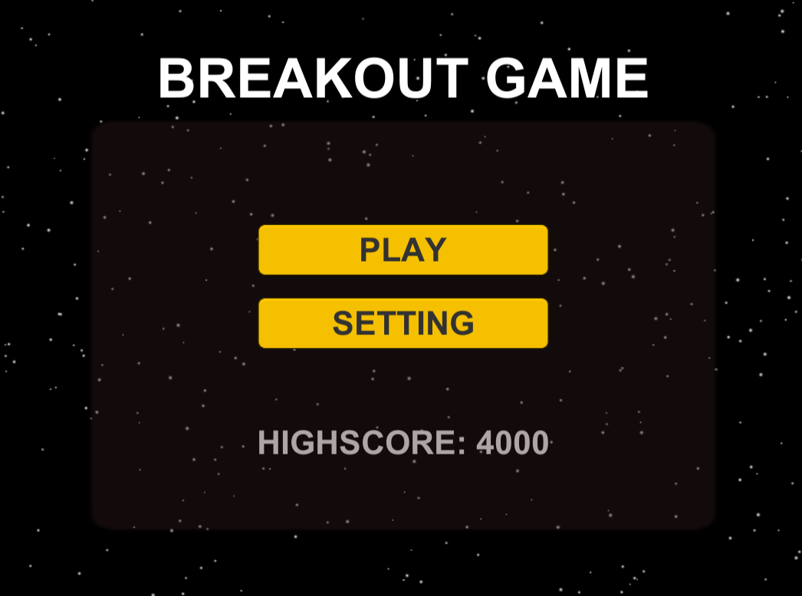

# Unity
Unity project for B23.1 GT2 Game Engines WiSe21/22
#### Internal Things
- No direct pushes to master, If you built a new feature then please checkout a new branch and then make a merge request
- Merge Requests has to be reviewed/tested by at least one person, if it was approved then it can be merged (please no hard feelings here and dob't anything personal :))
- Private fields has to start with an underscore please ("_")
- Please try to name your variables as accurate as possible (think of the people who don't know the code)
- Please try to stay within the convention of conventional commits https://www.conventionalcommits.org/en/v1.0.0/

# Game Idea
Our game is called the Breakout game and is inspired by the famous old game Breakout https://en.wikipedia.org/wiki/Breakout_(video_game) and based on this tutorial https://www.youtube.com/watch?v=gCqOnchV4V0. 

After Setting up the basic game, Elyess Eleuch started sketching some new ideas for the game. And he came up with the idea that we could instead of just breaking the bricks save a character which is stuck on an Island and surrounded by the bricks.  

## - Main Mechanic
* Set up different levels 
* Start Button
* Ende Screen
* Highscore
* If the character falls out of the screen and doesn't land on the paddle, you lose
* 3 Lives, you have only 3 balls and if you miss them all you lose.
* The scene is completely dark, there are two options the ball can enlighten a small part of the screen or you hit a lamp and the lights will turn on. 
* Different sound effects, for hitting the brick, the paddle, winning and losing

## - Genre & Art Style
* Action game
* Arcade
* Low Poly

## - How to play the game
to control the paddle that hits the ball you have two options, you can either control it with the mouse or with the keyboard. For the that you can access the sttings menu and put the parameters that you would like to have. There you can also adjust the music and sound effects volume. 
After starting the game, your main goal is to save the character and for that you have 3 balls that you can use. When you run out of balls you lose.
There different brick styles, each one has its own property, there ones that get destroyed after only one hit and ones after two hits.. hitting the brick accelerates the ball, so beware :). 
The whole scene starts dark, but at some point you will have the possiblity to turn the lights on by hitting the lamp :). 
There is a trick brick, once it gets hit it will generate a extra ball that has no light to make things a bit more diffcult. 
To stop the game you can hit the spacebar at anytime. 

## - Images 

## - Participants
 - Elyess Eleuch
 - Liav Keren
 - Sophie Preußer
 - Linh Pham
